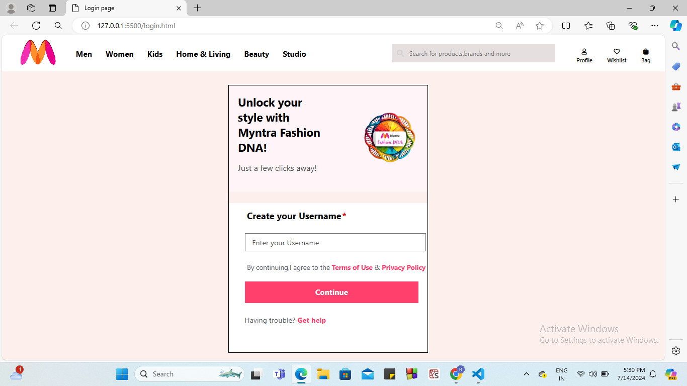
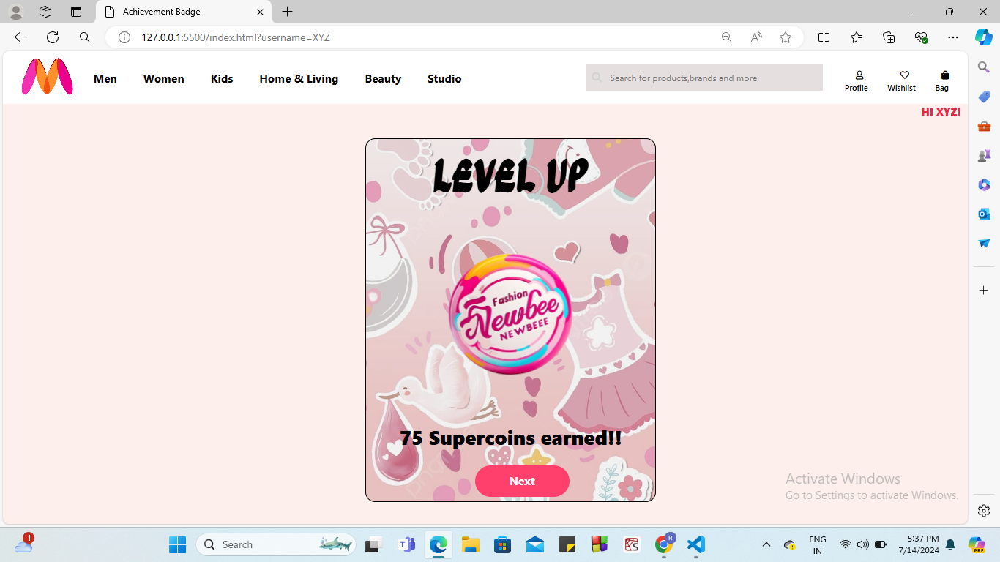
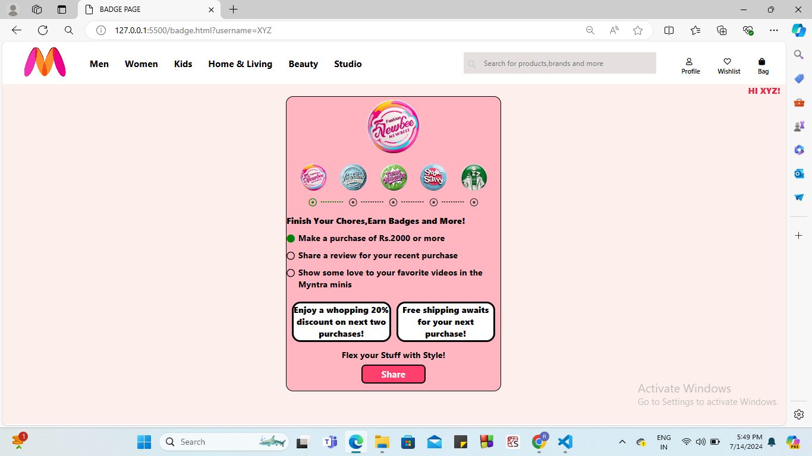
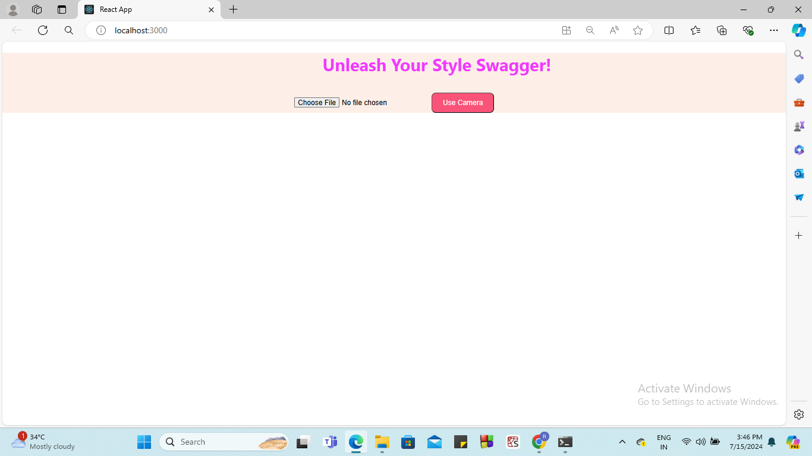

# TechTrio Myntra Project : #Fashion DNA Badge

This is the login page which will appear if user wants to Unlock MYNTRA FASHION DNA:

After giving Username(Let XYZ) and clicking on Continue , Achievement page appears(As user got NEWBEE badge just by logging in) :

After clicking on Next in Achievement Page , you will see Badge Page(main page) which contains information about how to grab your next badge and what rewards you get for that badge!

By running npm start command in command prompt(Windows) behind simultaneously.
Now after clicking Share button on badge page, a Lens Page will appear:

Now by clicking on Use Camera , we can click our pic:

